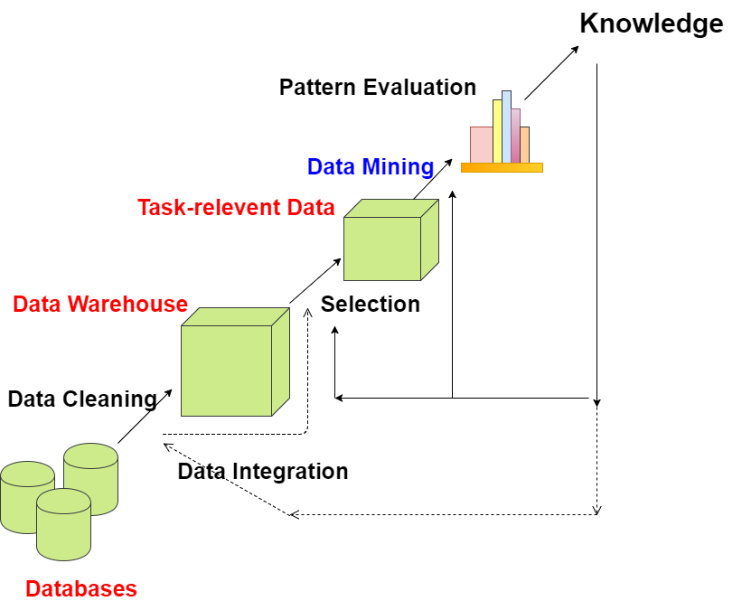
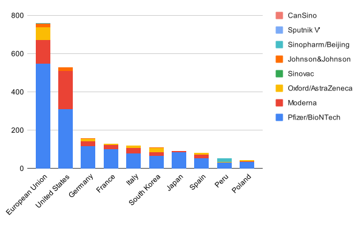
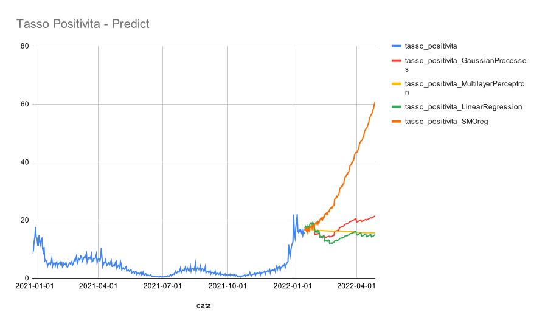

# Knowledge Discovery Process (KDP)
Data mining is the core part of the knowledge discovery process.

<!--
Inspired by:
http://www.lastnightstudy.com/Show?id=34/Knowledge-Discovery-Process-(KDP))
-->

KDP is a process of finding knowledge in data, it does this by using data mining methods (algorithms) in order to extract demanding knowledge from large amount of data.



1. Data cleaning -
First step in the Knowledge Discovery Process is Data cleaning in which noise and inconsistent data is removed.

2. Data Integration -
Second step is Data Integration in which multiple data sources are combined.

3. Data Selection -
Next step is Data Selection in which data relevant to the analysis task are retrieved from the database.

4. Data Transformation -
In Data Transformation, data are transformed into forms appropriate for mining by performing summary or aggregation operations.

5. Data Mining -
In Data Mining, data mining methods (algorithms) are applied in order to extract data patterns.

6. Pattern Evaluation -
In Pattern Evaluation, data patterns are identified based on some interesting measures.

7. Knowledge Presentation -
In Knowledge Presentation, knowledge is represented to user using many knowledge representation techniques.


# Data sets

## dpc-covid19-ita-andamento-nazionale
<!--
https://www.kaggle.com/sudalairajkumar/covid19-in-italy
-->

[dataset](https://raw.githubusercontent.com/pcm-dpc/COVID-19/master/dati-andamento-nazionale/dpc-covid19-ita-andamento-nazionale.csv)
, [dashbord ](https://opendatadpc.maps.arcgis.com/apps/dashboards/)


### Explore data set attributes data/dpc-covid19-ita-andamento-nazionale.csv

|name|type|num_values|distinct_count|total_count|missing_count|int_count|min|max
|-|-|-|-|-|-|-|-|-
|data|date|0|695|695|0|0|1.5825636E12|1.6425216E12
|stato|nominal|1|1|695|0|695|0.0|0.0
|ricoverati_con_sintomi|numeric|0|678|695|0|695|101.0|34697.0
|terapia_intensiva|numeric|0|599|695|0|695|26.0|4068.0
|totale_ospedalizzati|numeric|0|674|695|0|695|127.0|38507.0
|isolamento_domiciliare|numeric|0|693|695|0|695|94.0|2540993.0
|totale_positivi|numeric|0|693|695|0|695|221.0|2562156.0
|variazione_totale_positivi|numeric|0|680|695|0|695|-51884.0|172462.0
|nuovi_positivi|numeric|0|679|695|0|695|78.0|220532.0
|dimessi_guariti|numeric|0|694|695|0|695|1.0|6314444.0
|deceduti|numeric|0|695|695|0|695|7.0|141825.0
|casi_da_sospetto_diagnostico|numeric|0|160|695|533|162|0.0|988470.0
|casi_da_screening|numeric|0|162|695|533|162|0.0|653140.0
|totale_casi|numeric|0|695|695|0|695|229.0|9018425.0
|tamponi|numeric|0|695|695|0|695|4324.0|1.57819844E8
|casi_testati|numeric|0|640|695|55|640|935310.0|4.4547215E7
|note|nominal|44|44|695|651|44|0.0|0.0
|ingressi_terapia_intensiva|numeric|0|192|695|283|412|2.0|324.0
|note_test|string|0|0|695|695|0|0.0|0.0
|note_casi|string|0|0|695|695|0|0.0|0.0
|totale_positivi_test_molecolare|numeric|0|369|695|326|369|2351466.0|6786905.0
|totale_positivi_test_antigenico_rapido|numeric|0|369|695|326|369|957.0|2231520.0
|tamponi_test_molecolare|numeric|0|369|695|326|369|2.8617351E7|7.8396506E7
|tamponi_test_antigenico_rapido|numeric|0|369|695|326|369|116859.0|7.9423338E7

### Sample

```
head ../data/dpc-covid19-ita-andamento-nazionale.csv
data,stato,ricoverati_con_sintomi,terapia_intensiva,totale_ospedalizzati,isolamento_domiciliare,totale_positivi,variazione_totale_positivi,nuovi_positivi,dimessi_guariti,deceduti,casi_da_sospetto_diagnostico,casi_da_screening,totale_casi,tamponi,casi_testati,note,ingressi_terapia_intensiva,note_test,note_casi,totale_positivi_test_molecolare,totale_positivi_test_antigenico_rapido,tamponi_test_molecolare,tamponi_test_antigenico_rapido
2020-02-24T18:00:00,ITA,101,26,127,94,221,0,221,1,7,,,229,4324,,,,,,,,,
2020-02-25T18:00:00,ITA,114,35,150,162,311,90,93,1,10,,,322,8623,,,,,,,,,
2020-02-26T18:00:00,ITA,128,36,164,221,385,74,78,3,12,,,400,9587,,,,,,,,,
2020-02-27T18:00:00,ITA,248,56,304,284,588,203,250,45,17,,,650,12014,,,,,,,,,
2020-02-28T18:00:00,ITA,345,64,409,412,821,233,238,46,21,,,888,15695,,,,,,,,,
2020-02-29T18:00:00,ITA,401,105,506,543,1049,228,240,50,29,,,1128,18661,,,,,,,,,
2020-03-01T18:00:00,ITA,639,140,779,798,1577,528,566,83,34,,,1694,21127,,,,,,,,,
2020-03-02T18:00:00,ITA,742,166,908,927,1835,258,342,149,52,,,2036,23345,,,,,,,,,
2020-03-03T18:00:00,ITA,1034,229,1263,1000,2263,428,466,160,79,,,2502,25856,,,,,,,,,
```


## country_vaccinations

[dataset](https://www.kaggle.com/gpreda/covid-world-vaccination-progress)


> Remember to change Cote d'Ivoire to Cote d_Ivoire   in order to avoid parsing CSV error:

  ~~~
  $ sed -ie s/d\'/d_/g  country_vaccinations.csv

  ~~~


COVID-19 Dataset by Our World in Data
https://www.kaggle.com/gpreda/covid-world-vaccination-progress?select=country_vaccinations.csv#:~:text=country_vaccinations.-,csv,-country_vaccinations.csv%20


### Explore data set attributes data/country_vaccinations.csv
--

|name|type|num_values|distinct_count|total_count|missing_count|int_count|min|max
|-|-|-|-|-|-|-|-|-
|country|nominal|223|223|71815|0|71815|0.0|0.0
|iso_code|nominal|223|223|71815|0|71815|0.0|0.0
|date|nominal|415|415|71815|0|71815|0.0|0.0
|total_vaccinations|numeric|0|36847|71815|34296|37389|0.0|2.951846E9
|people_vaccinated|numeric|0|34781|71815|36098|35717|0.0|1.263691E9
|people_fully_vaccinated|numeric|0|31730|71815|38880|32935|1.0|1.220584E9
|daily_vaccinations_raw|numeric|0|24889|71815|41195|30620|0.0|2.4741E7
|daily_vaccinations|numeric|0|35706|71815|363|71452|0.0|2.2424286E7
|total_vaccinations_per_hundred|numeric|0|15374|71815|34296|608|0.0|325.99
|people_vaccinated_per_hundred|numeric|0|8651|71815|36098|589|0.0|122.49
|people_fully_vaccinated_per_hundred|numeric|0|8179|71815|38880|874|0.0|119.62
|daily_vaccinations_per_million|numeric|0|12213|71815|363|71452|0.0|117497.0
|vaccines|nominal|78|78|71815|0|71815|0.0|0.0
|source_name|nominal|83|83|71815|0|71815|0.0|0.0
|source_website|nominal|130|130|71815|694|71121|0.0|0.0


### Explore data set attributes data/country_vaccinations_by_manufacturer.csv
--

|name|type|num_values|distinct_count|total_count|missing_count|int_count|min|max
|-|-|-|-|-|-|-|-|-
|location|nominal|40|40|25783|0|25783|0.0|0.0
|date|nominal|403|403|25783|0|25783|0.0|0.0
|vaccine|nominal|8|8|25783|0|25783|0.0|0.0
|total_vaccinations|numeric|0|22830|25783|0|25783|0.0|5.47608975E8

# Goal

* Try to predict the spread of COVID-19 ahead of time to take preventive measures
* Which country is using what vaccine?





|Location|Pfizer/BioNTech|Moderna|Oxford/AstraZeneca|Sinovac|Johnson&Johnson|Sinopharm/Beijing|Sputnik&nbsp;V|CanSino
|-|-|-|-|-|-|-|-|-
|European Union|547|125|67|0|18|2|1|0
|United States|310|201|0|0|18|0|0|0
|Germany|117|26|12|0|3|0|0|0
|France|102|21|7|0|1|0|0|0
|Italy|80|27|12|0|1|0|0|0
|South Korea|65|21|22|0|1|0|0|0
|Japan|86|5|0|0|0|0|0|0
|Spain|55|18|9|0|1|0|0|0
|Peru|30|0|4|0|0|19|0|0
|Poland|35|3|5|0|2|0|0|0


* In which country the vaccination programme is more advanced?
* Where are vaccinated more people per day?
* But in terms of percent from entire population ?


dpc   2020-02-24T18:00:00  2022-01-18T17:00:00 695  -> 694
vacc  2020-12-27 - 2022-01-19  389 -> 395


https://github.com/pcm-dpc/COVID-19/blob/master/dati-andamento-covid19-italia.md


https://github.com/pcm-dpc/COVID-19/issues/864
Per ottenere una migliore approssimazione ho utilizzato fino ad ora:
Delta(casi totali)/Delta(nr Tamponi) - Delta(Guariti)


tasso_positivita = 100 * nuovi_positivi / Tamponi delta in percent




## Cost

|algorithm_name|elapsed (ms)
|-|-
|GaussianProcesses|1153
|MultilayerPerceptron|1487
|LinearRegression|134
|SMOreg|437


----------------

Goal:
Predict a value of a given continuous* valued variable
based on the values of other variables, assuming a linear
or nonlinear model of dependency.


1. Dataset

2. Dataset classification

  Ordered Temporal Data

1. Data preparation
2. Data preprocessing
3. Data mining
  1. Prediction
  2. Description
4. Postprocessing
5. Information
